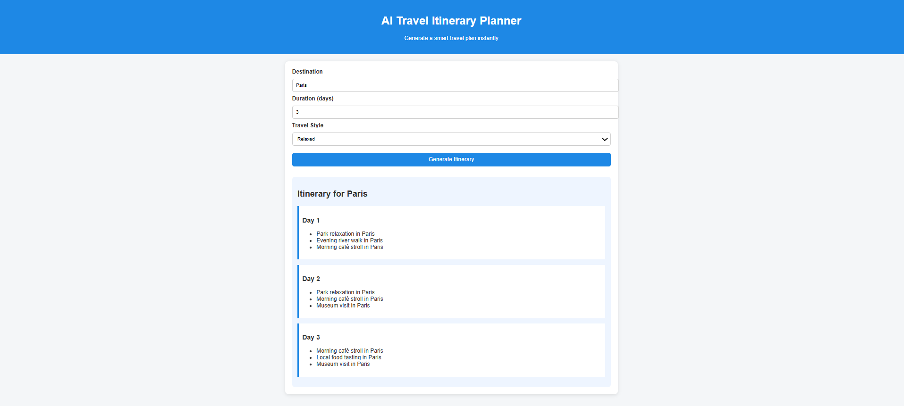
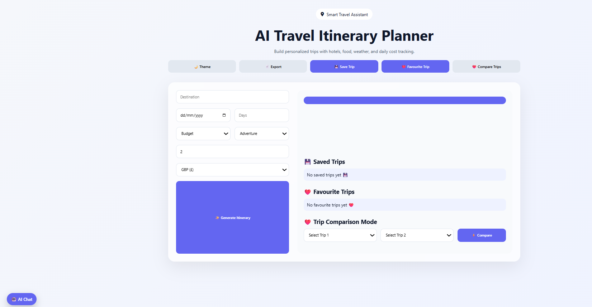
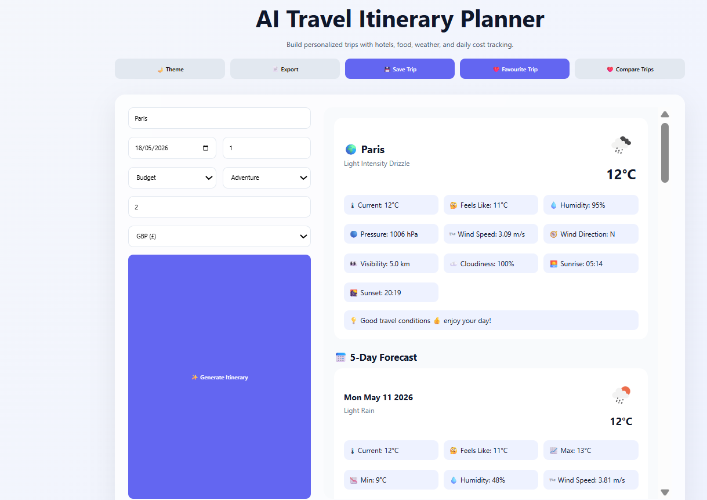
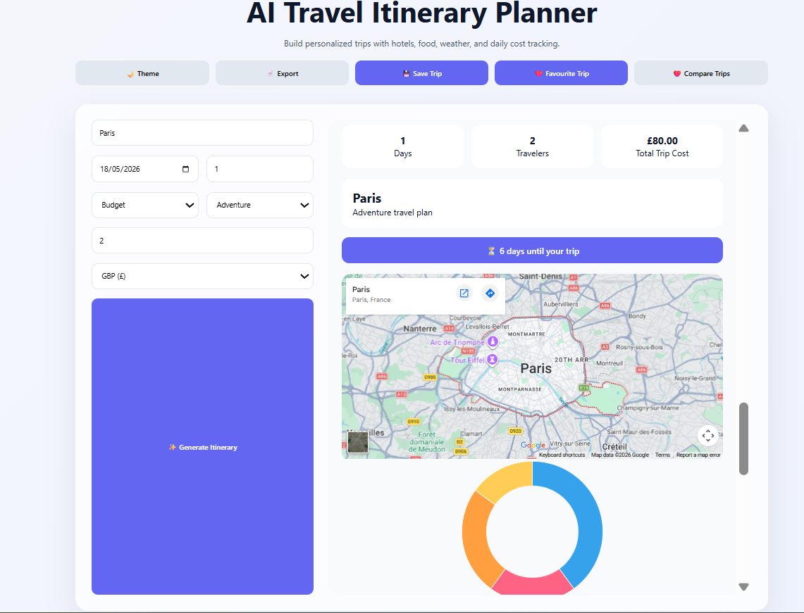
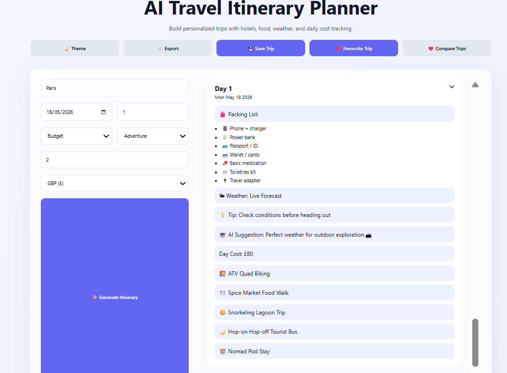
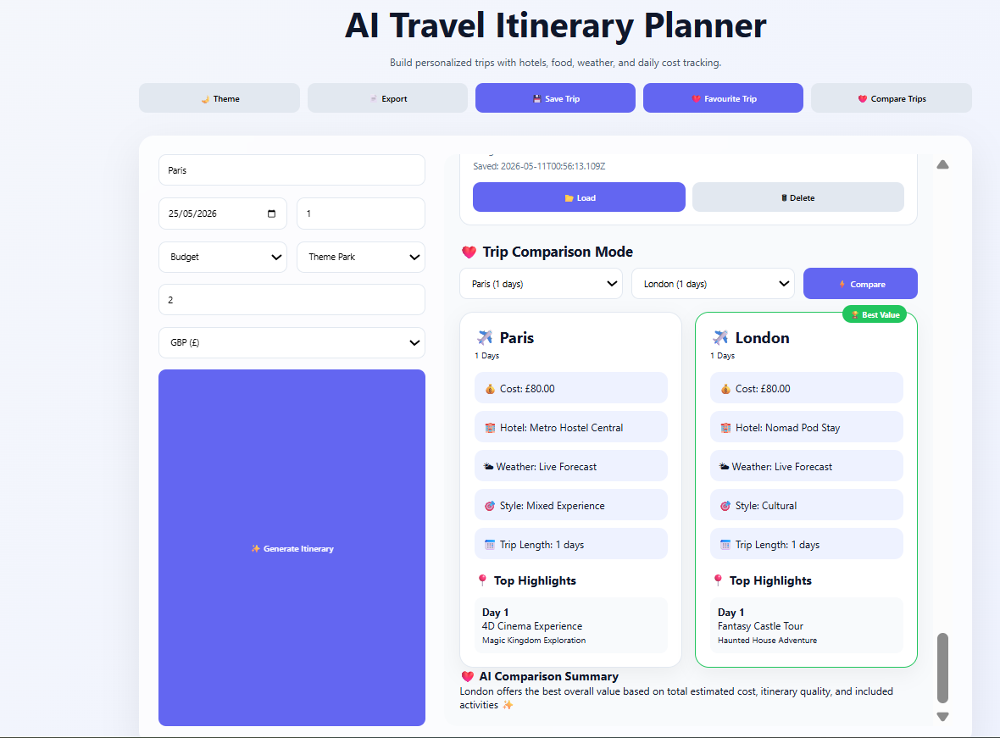
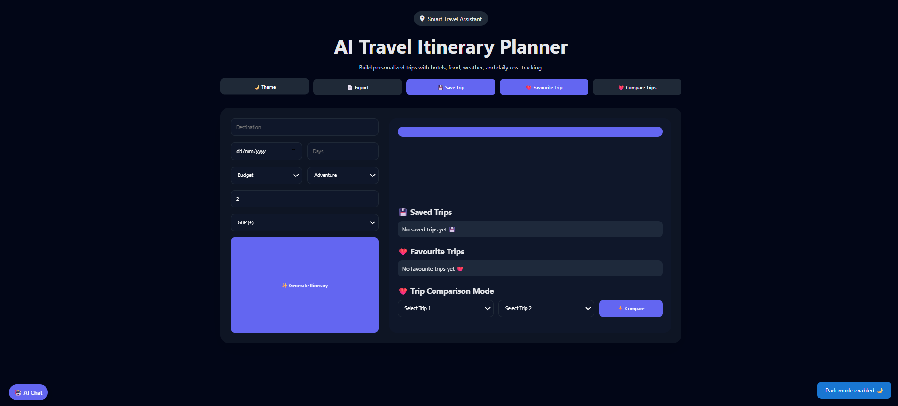

# AI-Travel-Itinerary-Planner

## 📌 Description
The AI Travel Itinerary Planner is an interactive, AI-style travel planning web application built with HTML, CSS, and JavaScript. It transforms user inputs into fully generated travel experiences, including daily itineraries, live weather forecasts, budget analytics, and intelligent travel recommendations.

The platform allows users to generate personalized trips, compare itineraries, save favourites, analyze costs, and interact with a built-in AI chat assistant — all within a modern, responsive UI.

## 🛠 Prerequisites

To run this project, you only need:
* 🌐 A modern web browser (Chrome, Edge, Firefox, Safari)
* 📶 Internet connection (for weather API + map integration)
  
## 📋 Features
Core Travel Planning Features
* AI-based travel itinerary generation
* Personalized trip planning
* Destination input
* Trip duration selection
* Start date selection

Budget selection:
* Budget
* Mid-Range
* Luxury

Travel style selection:
* Adventure
* Relaxation
* Cultural
* Romantic
* Food & Nightlife
* Theme Park

* Traveler count input

Currency selection:
* GBP
* USD
* EUR

User Interface Features
* Responsive layout
* Hero section/banner
* Modern glassmorphism UI
* Dark mode / light mode toggle
* Mobile responsive grids
* Interactive buttons
* Toast notifications
* Expandable/collapsible itinerary cards
* Scrollable forecast cards
* Fixed AI chat widget
* Theme park special card styling

Trip Generation Features
* Multi-day itinerary generation
* Randomized AI activity generation
* Morning / midday / afternoon / evening schedules
* Hotel recommendations
* Food recommendations
* Transportation suggestions
* Daily trip cost calculation
* Total trip budget estimation
* Packing list generation
* Smart weather-based suggestions
* AI travel tips

Weather System Features
* Live weather integration using OpenWeatherMap API
* Current weather display
* 5-day forecast
* Hourly weather forecast
* Weather icons
* Temperature display
* Feels-like temperature
* Humidity tracking
* Pressure tracking
* Wind speed tracking
* Wind direction conversion
* Visibility tracking
* Cloudiness tracking
* Sunrise & sunset times
* Rain probability
* UV advice
* Smart weather recommendations

## 💻 Technologies Used
The application is built with the following technologies:
* HTML
* CSS
* JavaScript
* Font Awesome for icons
* Chart.js for charts
* OpenWeather API
* Google Maps embed integration
* LocalStorage

## 🚀 Installation
No installation is required to use the app. It is hosted online and can be accessed via a web browser.

## 📚 Usage
1. Open the application in your browser
2. Enter travel details:
   *  Destination
   * Budget
   * Travel style
   * Duration
3. Click Generate Itinerary
4. Interact with features:
   * 🌦 View weather forecast
   * 💰 Check budget breakdown
   * 🗺 View map
   * ❤️ Save or favourite trips
   * ⚖ Compare trips
   * 🤖 Use AI chat assistant

## 🔗 Live Demo & Repository
Application can be viewed here: 
* 🌐 Live: https://yvonnesarah.github.io/AI-Travel-Itinerary-Planner/
* 💻 Repository: https://github.com/yvonnesarah/AI-Travel-Itinerary-Planner

## 🖼 Screenshot(S)
Before Design

AI Travel Itinerary Planner

After Design

AI Travel Itinerary Planner

AI Travel Itinerary Planner - Example 

AI Travel Itinerary Planner - Example - Map

AI Travel Itinerary Planner - Example - Plan

AI Travel Itinerary Planner - Compare Trips

AI Travel Itinerary Planner - Dark Theme

## 🗺️ Roadmap (Planned Features)
Budget & Analytics Features
* Budget breakdown visualization ✅
* Doughnut chart using Chart.js ✅

Cost category analysis:
* Hotels ✅
* Food ✅
* Activities ✅
* Transport ✅

* Currency formatting using Intl API ✅

Map & Location Features
* Embedded Google Maps integration ✅
* Dynamic destination map loading ✅
* Destination geolocation embedding ✅

Countdown Features
* Live trip countdown timer ✅
* Real-time days remaining calculation ✅
* Trip started notification ✅

Storage & Persistence Features

Local Storage Usage
* Theme persistence ✅
* Saved trips persistence ✅
* Favourite trips persistence ✅
* Generated trip tracking ✅

Saved Trips System
* Save generated trips ✅
* Load saved trips ✅
* Delete saved trips ✅
* Recently saved trips history ✅
* Trip duplication prevention ✅

Favourite Trips System
* Save favourite trips ✅
* Load favourite trips ✅
* Delete favourite trips ✅
* Favourite trip refresh/regeneration ✅

## 🚀 Upcoming Features
Trip Comparison Features
* Compare two saved trips ✅
* Trip comparison dashboard ✅
* Cost comparison ✅
* Hotel comparison ✅
* Weather comparison ✅
* Travel style detection ✅
* Trip length comparison ✅
* Highlight top itinerary moments ✅
* Automatic “Best Value” winner detection ✅
* AI-generated comparison summary ✅

AI Assistant Features

AI Chat Assistant
* Floating AI chat widget ✅
* Chat toggle system ✅
* User and bot message rendering ✅
* Simulated AI responses ✅
* Context-aware travel suggestions ✅

AI Responses Include
* Hotel suggestions ✅
* Weather guidance ✅
* Food recommendations ✅
* Packing advice ✅
* Budget insights ✅
* Itinerary help ✅
* Destination-aware recommendations ✅

Smart Recommendation Features

Weather Intelligence
* Rain recommendations ✅
* Hot weather advice ✅
* Cold weather advice ✅
* Outdoor activity optimization ✅
* Indoor activity fallback suggestions ✅

Packing Intelligence
* Weather-based packing lists ✅
* Theme park packing optimization ✅
* Essential travel items ✅
* Duplicate removal from packing lists ✅

Style Detection

Automatic trip categorization based on itinerary content:

* Theme Park ✅
* Relaxation ✅
* Cultural ✅
* Adventure ✅
* Food & Nightlife ✅
* Mixed Experience ✅

Export & File Features
* JSON export functionality ✅
* Downloadable travel plan file ✅
* Blob API usage ✅
* Dynamic file generation ✅

## 🧠 Advanced Features (Professional Level)
Animation & Interaction Features
* Hover animations ✅
* Smooth scrolling ✅
* Expand/collapse interactions ✅
* Transition animations ✅
* Interactive cards ✅
* Dynamic DOM rendering ✅

JavaScript Functional Features
* DOM manipulation ✅
* Event listeners ✅
* Async/await API handling ✅
* Fetch API ✅
* Dynamic HTML rendering ✅
* LocalStorage management ✅
* JSON serialization/deserialization ✅
* Template literals ✅
* Array manipulation ✅
* Conditional rendering ✅
* Responsive chart rendering ✅
* Timers and intervals ✅

UX Enhancements
* Success/error/info toast notifications ✅
* Smooth user flow ✅
* Smart validations ✅
* Empty-state handling ✅
* Duplicate trip prevention ✅
* Dynamic forecast loading states ✅
* Real-time UI updates ✅
* Automatic UI refresh after saving/loading ✅

Special Theme Park Features
* Theme park itinerary mode ✅
* Theme park themed cards ✅
* Ride-focused activities ✅
* Fast-pass recommendations ✅
* Theme park packing suggestions ✅
* Special emoji/icon rendering for rides and attractions ✅

## 🧠 Challenges & Learnings
🚧 Challenges Faced
1. Managing application state without a framework
2. Synchronizing weather API with itinerary generation
3. Building a comparison system using vanilla JavaScript
4. Designing scalable travel data structures
5. Handling localStorage persistence across multiple features

📚 Key Learnings
1. Advanced DOM manipulation in vanilla JavaScript
2. API integration (weather + maps)
3. Data visualization with Chart.js
4. State management without frameworks
5. Modular JavaScript architecture design
6. UX design for complex interactive dashboards

## 👥 Credit
Designed and developed by Yvonne Adedeji.

## 📜 License
This project is open-source. For licensing details, please refer to the LICENSE file in the repository.

## 📬 Contact
You can reach me at 📧 yvonneadedeji.sarah@gmail.com.
